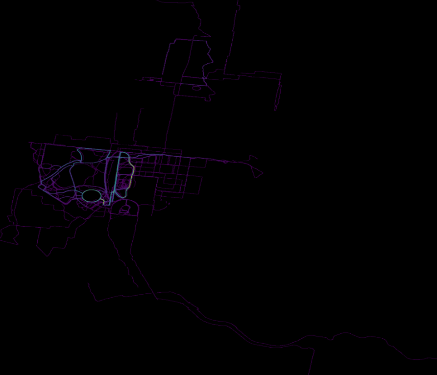

# heatmap  
July 2020

This is a work-in-progress to produce something like the [Strava global heatmap](https://medium.com/strava-engineering/the-global-heatmap-now-6x-hotter-23fc01d301de)); though on an individual scale. The final version will be animated (though it remains to be seen how good this will look!).

